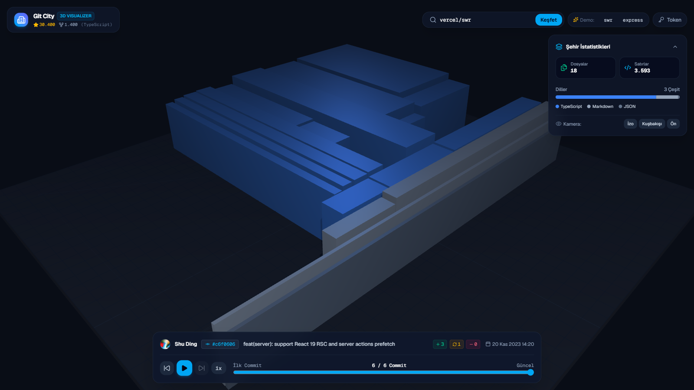

# 🏙️ Git City — 3D Code Visualizer & Timeline Simulator

Turn any GitHub repository into an interactive 3D isometric city with a commit timeline simulator.

[](https://city.ibrahimhalilsezgin.com)



## ✨ Features

- **🏛️ Squarified Treemap Layout:** Folders turn into city districts, files become buildings, lines of code (LOC) dictate building heights.
- **⏳ Interactive Commit Timeline:** Play/Pause auto-simulation, 0.5x–4x speed, and scrubbing slider to watch your project grow commit-by-commit.
- **🎨 Pastel Language Coding:** Automatic syntax detection and pastel palette coloring for over 25+ programming languages.
- **⚡ Zero-Config Demo Repos:** Instant offline exploration with rich snapshots for `vercel/swr` and `expressjs/express`.
- **🔑 GitHub API & Personal Access Token:** Query any public or private repository with PAT support to bypass anonymous rate limits.
- **🎥 Isometric & Perspective Camera Controls:** Free OrbitControls (pan, tilt, zoom), plus quick presets (Isometric, Top-Down, Front).
- **📊 Real-time Codebase Telemetry:** Dynamic language distribution breakdown, active contributor cards, and raycast inspection tooltips.

---

## 🛠️ Tech Stack

- **Framework:** Next.js 16 (App Router)
- **Language:** TypeScript
- **Styling:** Tailwind CSS
- **3D Engine:** Three.js & OrbitControls
- **Icons:** Lucide React

---

## 🚀 Getting Started

### 1. Clone & Install
```bash
git clone https://github.com/ibrahimhalilsezgin/git-city.git
cd git-city
npm install
```

### 2. Run Development Server
```bash
npm run dev
```

Open [http://localhost:3000](http://localhost:3000) in your browser.

---

## 🎮 Controls

- **Left Mouse Click + Drag:** Rotate camera
- **Right Mouse Click + Drag:** Pan camera
- **Scroll Wheel:** Zoom in / out
- **Hover on Building:** View filename, LOC, and language
- **Click on Building:** Inspect file details and lock camera target
- **Spacebar:** Play / Pause timeline simulation
- **Left / Right Arrow Keys:** Step backward / forward through commits

---

Built by [İbrahim Halil Sezgin](https://ibrahimhalilsezgin.com).
